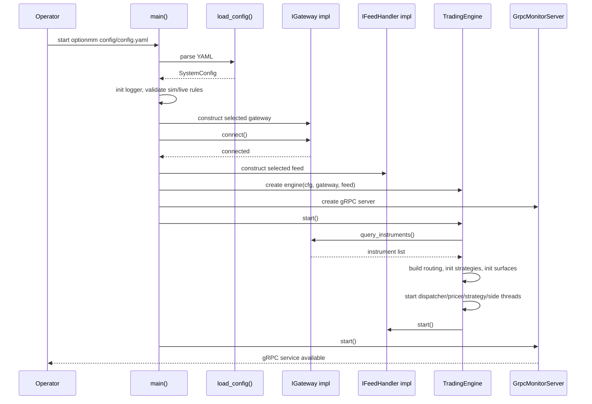
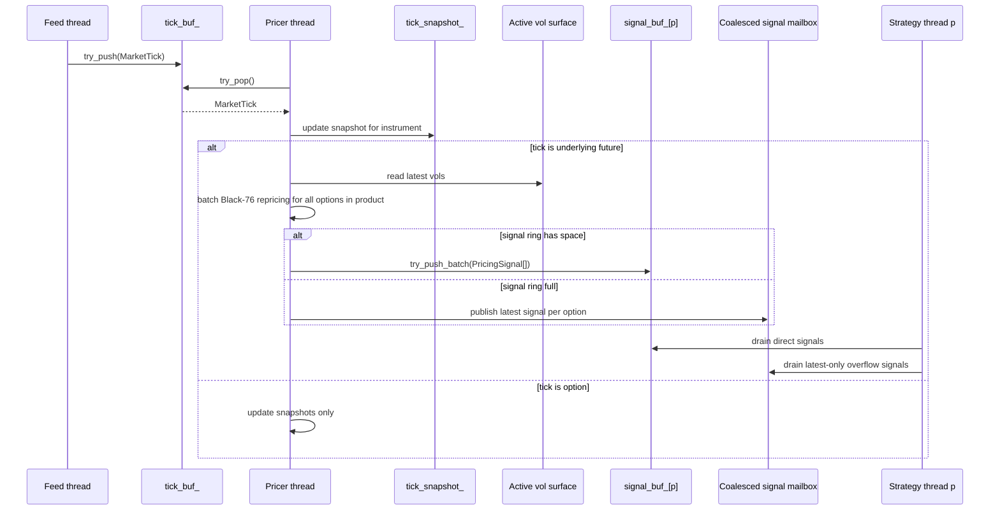
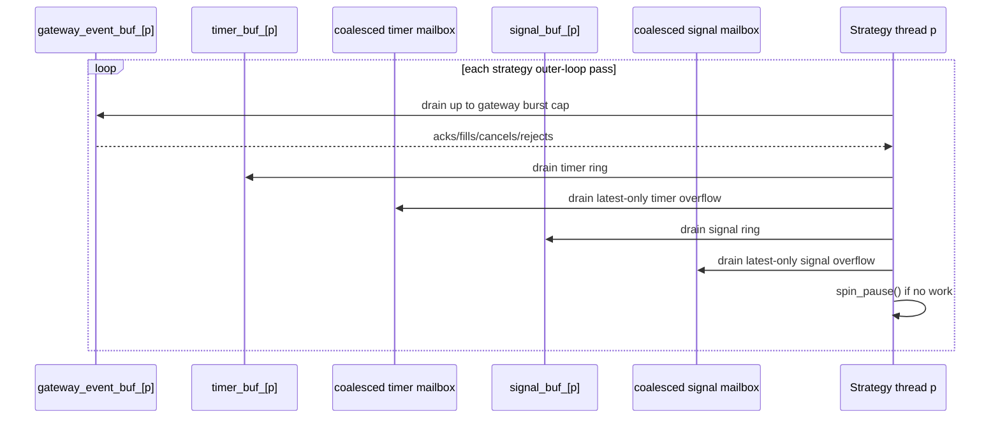
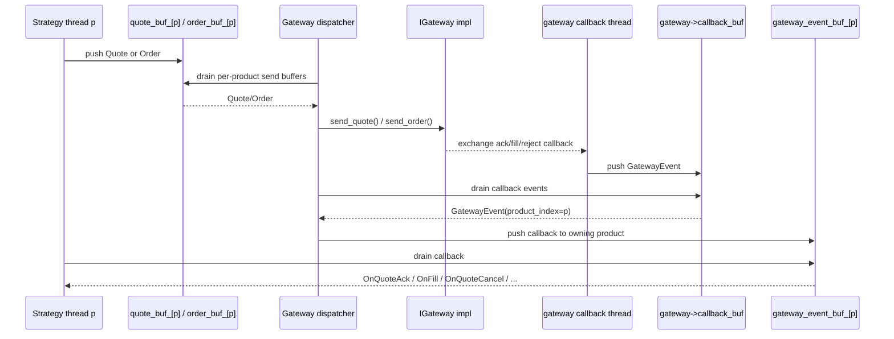
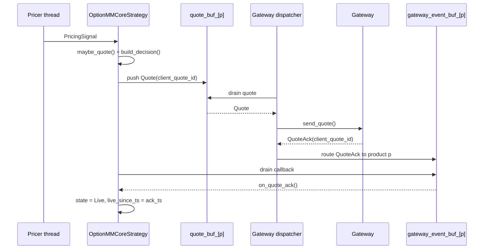
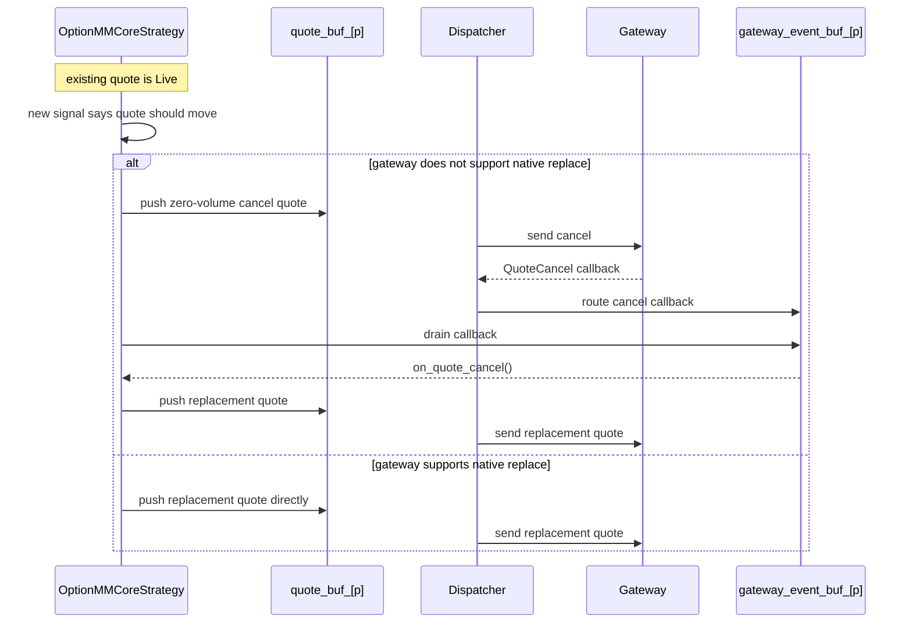
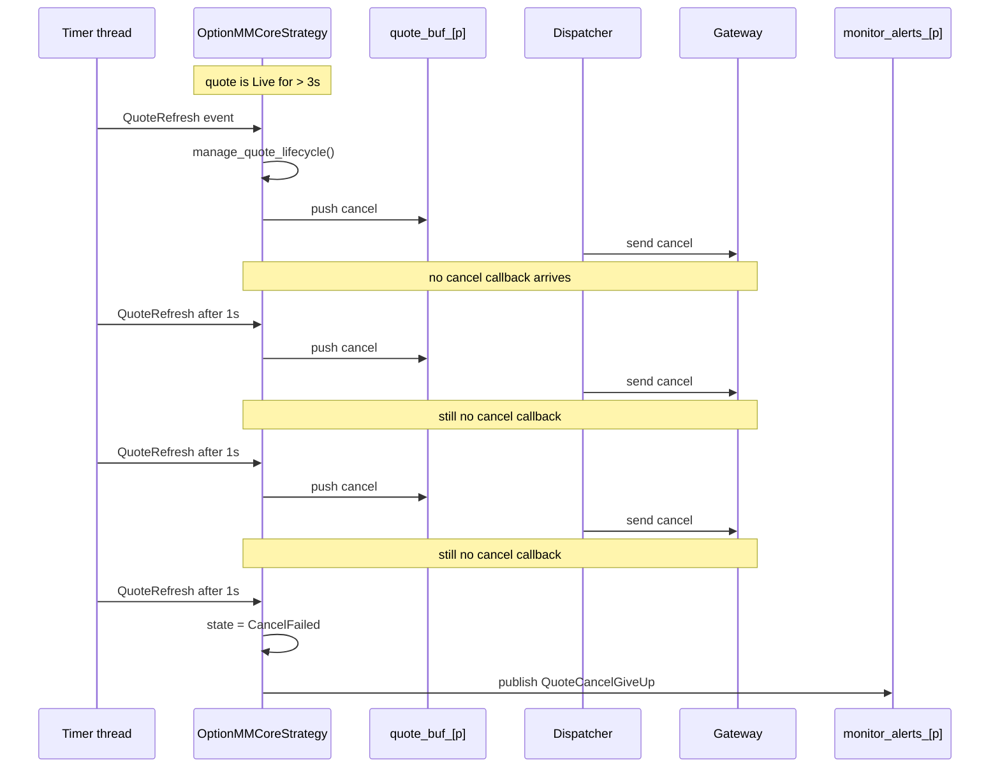
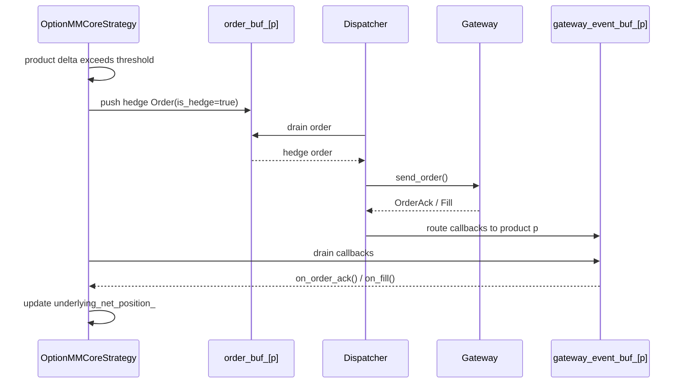
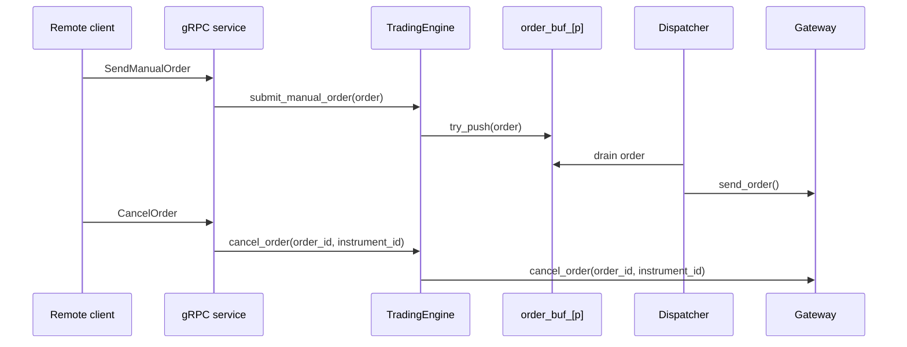

# optionMM Low-Level Design (LLD)

## 1. About This Document

### 1.1 Why this document exists

This document explains how `optionMM` is designed and how the code actually works today.

It is written for two readers:

- New developers who need to understand the system quickly and change it safely.
- Supervisors who need a concrete explanation of architecture, latency design, deployment shape, and testing.

This document is intentionally more like a product-style reference guide than a short design memo:

- start with a 5-minute overview
- define the important concepts
- explain each runtime stage in detail
- walk through the quote lifecycle step by step
- explain the low-latency design one principle at a time
- give a practical "what should I change for requirement X?" guide

### 1.2 Source of truth

This LLD describes the current repository behavior at repo HEAD.

If this document and older notes differ, the code wins.

Main reference points used while writing this document:

- `src/main.cpp`
- `include/common/config.h`
- `include/common/types.h`
- `include/common/ring_buffer.h`
- `include/feed/feed_handler.h`
- `include/gateway/gateway.h`
- `include/engine/trading_engine.h`
- `src/engine/trading_engine.cpp`
- `include/strategy/option_mm_core.h`
- `src/strategy/option_mm_core.cpp`
- `src/risk/pre_trade_risk.cpp`
- `src/risk/post_trade_risk.cpp`
- `proto/trading.proto`
- `src/monitoring/grpc_server.cpp`
- `README-rhel8.md`
- `tests/test_option_mm_core.cpp`
- `tests/test_latency.cpp`

### 1.3 If you are new, read these sections first

If you only have 30 minutes, read in this order:

1. Section 2: System in 5 Minutes
2. Section 5: Runtime Stages
3. Section 6: Quote Lifecycle
4. Section 9: Developer Cookbook
5. Section 11: Latency Test Cases

## 2. System in 5 Minutes

### 2.1 What `optionMM` is

`optionMM` is an ultra-low-latency options market-making system.

At a high level it does four things:

1. Receive market data.
2. Compute theoretical option values and Greeks.
3. Decide what quotes or hedge orders to send.
4. Send them to the exchange gateway and react to exchange callbacks.

Everything else, such as risk monitoring, volatility fitting, logging, gRPC monitoring, and GUI support, exists to support those four steps without slowing them down.

### 2.2 What one process instance represents

One `optionMM` process instance is configured by one YAML file.

That process is fixed at startup to:

- one feed type
- one gateway type
- one exchange/account deployment context

Within that one process, the engine can market-make multiple products at the same time.

In this repo, a "product" means one underlying future plus the option instruments that belong to that underlying. Each product gets its own strategy thread.

### 2.3 The most important design rule

The single most important design rule in this codebase is:

**One hot-path state owner per stage.**

Examples:

- Feed thread owns feed ingress.
- Pricer thread owns pricing calculation and Greek snapshots.
- Product strategy thread owns quote state for that product.
- Gateway dispatcher thread owns all send calls to the gateway.

This rule is the reason the system can use simple fixed-size SPSC queues and avoid a large amount of lock contention.

### 2.4 Hot path vs side path

The system is easiest to understand if you separate it into hot path and side path.

Hot path:

```text
tick -> pricing signal -> quote decision -> gateway send -> callback -> strategy reaction
```

Side path:

```text
vol fitting
risk aggregation
monitoring streams
manual controls
logging
GUI
```

Design goal:

- Hot path must be short, bounded, predictable, and allocation-free.
- Side path is allowed to be slower, richer, and easier to operate.

### 2.5 The full picture in one diagram

```text
                    +----------------------+
                    |   Feed Handler       |
                    | multicast/fpga/sim   |
                    +----------+-----------+
                               |
                               v
                    +----------------------+
                    | tick_buf_            |
                    | SPSC ring            |
                    +----------+-----------+
                               |
                               v
                    +----------------------+
                    | Pricer Thread        |
                    | Black-76 + snapshots |
                    +----------+-----------+
                               |
             +-----------------+-----------------+
             |                                   |
             v                                   v
   +----------------------+           +----------------------+
   | signal_buf_[p]       |           | greeks_snapshot_     |
   | or coalesced mailbox |           | tick_snapshot_       |
   +----------+-----------+           +----------+-----------+
              |                                  |
              v                                  |
   +----------------------+                      |
   | Strategy Thread p    |                      |
   | OptionMMCoreStrategy |                      |
   +-----+-----------+----+                      |
         |           |                           |
         |           +--------------------+      |
         |                                |      |
         v                                v      v
 +---------------+              +----------------------+
 | quote_buf_[p] |              | side threads         |
 | order_buf_[p] |              | vol/risk/monitor     |
 +-------+-------+              +----------------------+
         |
         v
 +----------------------+
 | Gateway Dispatcher   |
 +----------+-----------+
            |
            v
 +----------------------+
 | IGateway impl        |
 | sim/ctp/femas        |
 +----------+-----------+
            |
            v
 +----------------------+
 | callback_buf         |
 +----------+-----------+
            |
            v
 +----------------------+
 | Gateway Dispatcher   |
 | routes to product p  |
 +----------+-----------+
            |
            v
 +----------------------+
 | gateway_event_buf_[p]|
 +----------+-----------+
            |
            v
 +----------------------+
 | Strategy Thread p    |
 +----------------------+
```

## 3. Core Concepts

This section defines the words used throughout the system.

### 3.1 Product

A product is the unit of strategy ownership.

In config, each product is defined by:

- one underlying futures code such as `cu2501`
- one strategy type
- one CPU core for the strategy thread
- one parameter set

All option instruments that belong to that underlying are routed to that product's strategy thread.

### 3.2 Instrument

An instrument is a tradeable contract.

Important kinds:

- future
- option

The engine assigns every instrument a compact internal `instrument_id` at startup so hot-path code can use O(1) array indexing instead of string lookup.

Important `Instrument` fields:

| Field | Meaning |
| --- | --- |
| `code` | Exchange instrument code |
| `underlying_code` | Underlying future code |
| `kind` | Future or Option |
| `option_type` | Call or Put |
| `strike` | Strike price |
| `tick_size` | Minimum price increment |
| `expiry_epoch_ns` | Expiry in engine time base |
| `instrument_id` | Internal integer id |
| `underlying_id` | Internal id of underlying future |
| `product_index` | Which strategy thread owns it |

### 3.3 Tick

A `MarketTick` is the normalized market-data payload used inside the engine.

Important details:

- It is hot-path data.
- It is `alignas(64)`.
- It is exactly 256 bytes.
- It contains best 5 bid/ask levels, sizes, timestamps, and a sequence number.

The feed handler converts exchange-specific raw market data into `MarketTick`.

### 3.4 Pricing signal

A `PricingSignal` is the compact message sent from the pricer thread to a strategy thread.

It is intentionally smaller than a full Greeks snapshot:

- size is 64 bytes
- enough data to make a quote decision
- full Greeks remain in `greeks_snapshot_` for monitoring and risk

Important fields:

- `instrument_id`
- `underlying_id`
- `theo_bid`
- `theo_ask`
- `delta`
- `vega`
- `underlying_ref_bid`
- `underlying_ref_ask`

### 3.5 Quote, order, and trade

`Quote`:

- two-sided passive market-making message
- carries bid/ask prices and bid/ask volumes
- used for exchange quote APIs and quote cancel semantics

`Order`:

- single-sided order
- used mainly for hedge orders and manual orders

`Trade`:

- fill report from gateway callback flow
- used to update position and risk

### 3.6 Snapshot

A snapshot is read-mostly state that one owner updates and many side-path readers consume.

Important snapshots:

- `tick_snapshot_`
- `greeks_snapshot_`
- active vol surfaces

Snapshots exist so hot-path producers do not have to synchronize directly with readers like gRPC handlers.

### 3.7 Monitoring topic

A `MonitoringTopic<T, Capacity>` is a fixed-size single-writer history buffer with many polling readers.

Writers never block.

Lagging readers may skip old entries if they fall behind the retained history window.

This is used for:

- ticks
- orders
- quotes
- trades
- per-product system alerts

## 4. Process Lifecycle

### 4.1 Startup sequence

The process startup path is straightforward and intentionally explicit.

Detailed sequence:

1. `main()` checks command-line arguments.
2. `load_config()` parses YAML into `SystemConfig`.
3. Logger starts.
4. `main()` decides whether the process is in sim mode.
5. If sim mode is enabled, pricing method is forced to `OrcWing`.
6. `main()` validates that sim feed and sim gateway are used together.
7. `main()` constructs the selected gateway implementation:
   - `CTPGateway`
   - `FEMASGateway`
   - `SimGateway`
8. Gateway connects.
9. `main()` constructs the selected feed implementation:
   - `MulticastFeedHandler`
   - `FPGAFeedHandler`
   - `FEMASFeedHandler`
   - `SimFeedHandler`
10. `TradingEngine` is created with the config, gateway, and feed.
11. `GrpcMonitorServer` is created.
12. `TradingEngine::start()` performs:
   - floating-point environment setup
   - instrument query from the gateway
   - routing-table construction
   - per-product option index construction
   - cached option metadata initialization
   - strategy initialization
   - vol-surface initialization
   - thread creation
13. Feed starts.
14. gRPC server starts.
15. Process enters the main signal-wait loop.

#### Startup sequence diagram



### 4.2 Shutdown sequence

Shutdown order matters because some threads depend on others still being alive.

Current shutdown flow:

1. Stop signal is set.
2. Feed is stopped first.
3. Engine threads are joined.
4. Gateway disconnects.
5. gRPC server shuts down.
6. Logger shuts down.

### 4.3 Why startup does more work than the hot path

This is deliberate.

The project moves as much work as possible to startup:

- choose feed and gateway once
- build instrument registry once
- assign product ownership once
- cache option `log(K)` once
- initialize surfaces once

That way the hot path does not need to keep re-solving the same setup problems on every tick.

## 5. Threads, Queues, and Ownership

This is the most important low-level section in the document.

If a developer misunderstands thread ownership, they will almost certainly introduce latency regressions or race conditions.

### 5.1 Thread inventory

| Thread | Created by | Hot or side | Main responsibility |
| --- | --- | --- | --- |
| Feed thread | Feed handler | Hot ingress | Decode market data and push `MarketTick` into `tick_buf_` |
| Pricer thread | Engine | Hot | Reprice options, update snapshots, emit `PricingSignal` |
| Strategy thread per product | Engine | Hot | Own product strategy state and quote lifecycle |
| Gateway dispatcher thread | Engine | Hot | Send all orders/quotes and route all gateway callbacks |
| Monitor publisher thread | Engine, only in deferred mode | Side | Drain deferred monitor rings into monitoring topics |
| Vol fitter thread | Engine | Side | Build new vol surfaces periodically |
| Risk monitor thread | Engine | Side | Process fills and recompute portfolio breaches |
| Timer thread | Engine | Side, but latency-sensitive | Produce hedge checks and quote refresh events |
| gRPC thread(s) | gRPC runtime | Side | Serve monitoring streams and control RPCs |

### 5.2 Queue inventory

All hot queues are fixed-size ring buffers owned by the engine.

| Buffer | Type | Capacity | Producer | Consumer |
| --- | --- | --- | --- | --- |
| `tick_buf_` | `MarketTick` | 1024 | Feed thread | Pricer thread |
| `signal_buf_[p]` | `PricingSignal` | 256 | Pricer thread | Strategy thread `p` |
| `gateway_event_buf_[p]` | `GatewayEvent` | 512 | Dispatcher thread | Strategy thread `p` |
| `timer_buf_[p]` | `TimerEvent` | 64 | Timer thread | Strategy thread `p` |
| `order_buf_[p]` | `Order` | 512 | Strategy thread `p` | Dispatcher thread |
| `quote_buf_[p]` | `Quote` | 512 | Strategy thread `p` | Dispatcher thread |
| `risk_buf_` | `Trade` | 256 | Dispatcher thread | Risk monitor thread |
| `deferred_monitor_orders_` | `Order` | 4096 | Dispatcher thread | Monitor publisher thread |
| `deferred_monitor_quotes_` | `Quote` | 4096 | Dispatcher thread | Monitor publisher thread |
| `deferred_monitor_trades_` | `Trade` | 4096 | Dispatcher thread | Monitor publisher thread |
| `gateway_->callback_buf` | `GatewayEvent` | 1024 | Gateway internal thread | Dispatcher thread |

### 5.3 Why SPSC is enough

The engine is designed so each ring buffer only needs one producer and one consumer.

Examples:

- There is exactly one pricer thread, so one producer for `signal_buf_[p]`.
- There is exactly one strategy thread per product, so one consumer for `signal_buf_[p]`.
- There is exactly one dispatcher thread, so one consumer for every `order_buf_[p]` and `quote_buf_[p]`.

This matters because SPSC queues are simpler and faster than general-purpose multi-producer or multi-consumer queues.

### 5.4 What is allowed to mutate what

This table should be treated as a design contract.

| State | Owner | Who may read |
| --- | --- | --- |
| `tick_buf_` cursor state | feed/pricer | only producer and consumer |
| `tick_snapshot_` | pricer thread | vol fitter, gRPC, strategy |
| `greeks_snapshot_` | pricer thread | risk monitor, gRPC |
| strategy `OptionState` | product strategy thread | nobody else should mutate |
| `order_buf_[p]`, `quote_buf_[p]` | strategy thread `p` writes | dispatcher reads |
| `gateway_event_buf_[p]` | dispatcher writes | strategy thread `p` reads |
| `PostTradeRisk` breach flags | risk monitor thread writes | strategy and gRPC read |
| `AtomicMMParams` | gRPC writes | strategy reads |
| monitoring topics | one writer per topic | many readers |

### 5.5 Affinity and pinning

Config includes affinity for:

- `feed_core`
- `pricer_core`
- `gateway_dispatcher_core`
- `vol_fitter_core`
- `risk_monitor_core`
- `timer_core`
- `products[i].strategy_core`
- `grpc_server_core`

Current implementation pins:

- feed thread if the feed implementation does so
- pricer
- dispatcher
- strategy threads
- vol fitter
- risk monitor
- timer

Current implementation does **not** pin the gRPC server thread even though a config field exists for it.

That is a useful detail for future cleanup or enhancement.

## 6. Runtime Stages in Detail

This section explains each pipeline stage in the same order data actually flows through the system.

### 6.1 Feed stage

#### What the feed stage does

The feed stage receives exchange or simulator market data and converts it into the internal `MarketTick` format.

All feed types implement `IFeedHandler`.

Responsibilities of a feed adapter:

- maintain connectivity to the market-data source
- translate exchange-specific instrument code to internal `instrument_id`
- normalize timestamps and prices into `MarketTick`
- push ticks into `tick_buf_`
- track message, error, and drop counters

#### Feed types in this repo

| Feed type | Purpose |
| --- | --- |
| `multicast` | Network multicast feed path |
| `fpga` | Hardware-assisted low-latency feed path |
| `femas` | FEMAS market data feed |
| `sim` | Local development and test feed |

#### Important design choices

- Feed handlers write only into `tick_buf_`.
- They do not price options.
- They do not make strategy decisions.
- They do not know product-level business logic.

This separation keeps the feed stage small and reusable.

### 6.2 Pricer stage

#### What the pricer thread owns

The pricer thread owns:

- reading `tick_buf_`
- updating `tick_snapshot_`
- calculating theoretical option prices and Greeks
- publishing `PricingSignal`s to strategy threads
- updating `greeks_snapshot_`

#### The key modeling choice: future-driven repricing

The current engine reprices a product's option book when a **future tick** arrives.

That is a critical design decision.

Why:

- The underlying future is the primary driver of theoretical option value.
- Repricing the whole option book on a future tick matches the market-making decision model.
- Option ticks are still useful, but mostly as market reference and for vol fitting.

Current behavior:

- Future tick:
  - update the future entry in `tick_snapshot_`
  - mark that product as pending repricing
  - reprice all options in that product in batches
  - emit `PricingSignal`s
- Option tick:
  - update the option entry in `tick_snapshot_`
  - publish monitoring tick
  - do **not** emit a `PricingSignal`

#### Tick-to-signal sequence diagram



#### Batch pricing

The pricer uses a batch size of up to 128 options.

Before pricing, it reuses cached per-option metadata:

- `log(K)`
- `T`
- `sqrt(T)`
- discount factor `exp(-rT)`

This avoids repeating expensive transcendentals on every repricing cycle.

#### Vol surface usage

The pricer reads from the currently active published surface:

- `Wing`
- `OrcWing`
- `SVI`

depending on config.

The active surface is read-only from the pricer's perspective.

#### What the pricer publishes

For each repriced option it creates:

1. `PricingSignal` for the owning strategy thread
2. `Greeks` snapshot entry for risk and monitoring

#### What happens when signal ring is full

If `signal_buf_[p]` is full, the engine does **not** block the pricer thread.

Instead it:

1. stores the latest signal for that option in a coalesced mailbox slot
2. records a version number
3. lets the strategy thread drain the latest version later

This means the system prefers dropping stale intermediate work over building an unbounded backlog.

### 6.3 Strategy stage

#### What one strategy thread owns

A strategy thread owns one product.

Inside that product it owns:

- quote state for each option
- product-level inventory/exposure state
- hedge order state
- suppression state
- strategy parameter reads

No other thread should directly mutate this state.

#### What the strategy thread consumes

The strategy loop consumes three input sources:

1. gateway callbacks from `gateway_event_buf_[p]`
2. timer events from `timer_buf_[p]` and coalesced timer mailbox
3. pricing signals from `signal_buf_[p]` and coalesced signal mailbox

#### Fairness policy inside strategy loop

The current loop does not drain any one source forever.

It uses burst caps:

- gateway events: 32
- timers: 8
- pricing signals: 128

This is important because:

- callback storms should not starve fresh pricing signals
- timer bursts should not starve quote updates
- pricing bursts should not delay fills and cancels forever

#### Strategy scheduling sequence diagram



#### Current strategy implementations

This repo contains:

- `SimpleMMStrategy`
- `OptionMMCoreStrategy`

The main production-style path is `OptionMMCoreStrategy`.

### 6.4 Gateway dispatcher stage

#### Why there is a dispatcher thread

The dispatcher exists to centralize all gateway sends on one thread.

Without it:

- every strategy thread would need to call the gateway directly
- gateway implementations would need stronger internal synchronization
- send-path contention and ordering complexity would increase

With the dispatcher:

- strategies only push messages into per-product output rings
- the dispatcher performs all actual `send_order()` and `send_quote()` calls
- gateway callbacks are also normalized back through one place

#### Dispatcher work

The dispatcher loop does two classes of work:

1. Drain gateway callback buffer and route callbacks to the owning product.
2. Drain product order and quote buffers and send them to the gateway.

#### Fairness policy inside dispatcher

The current dispatcher gives callbacks a bounded head start, then interleaves them with sends:

- callback lead burst: 16
- callback interleave burst: 8
- per-product order send burst: 64
- per-product quote send burst: 128

This avoids two bad extremes:

- callbacks starve sends
- sends starve callbacks

#### Dispatcher send/callback sequence diagram



### 6.5 Side threads

#### Vol fitter

Runs periodically, not on every tick.

For each product it:

1. groups options by expiry
2. reads latest market mid-prices
3. inverts Black-76 to market implied vol
4. fits a surface slice
5. publishes the new surface snapshot

If there are too few valid points, it keeps the existing slice.

#### Risk monitor

Consumes fills from `risk_buf_` and recomputes:

- positions
- portfolio delta
- portfolio gamma
- portfolio vega
- portfolio theta
- breach flags

This is intentionally asynchronous.

#### Timer thread

Produces:

- hedge checks
- quote refreshes
- session open/close events
- periodic `T` refresh work

Timer events also use coalescing when needed.

#### Monitor publisher

Only exists when `hot_path_publish_mode = deferred`.

In that mode, orders, quotes, and trades are first pushed into deferred monitor rings and then copied into monitoring topics by this background thread.

This removes some monitoring overhead from the dispatcher thread.

## 7. Quote Lifecycle and Order Flow

This section is the most important business-logic section in the system.

### 7.1 Where the lifecycle lives

The full quote lifecycle is owned by `OptionMMCoreStrategy`.

It is not split across:

- a special cancel thread
- gateway code
- risk monitor
- timer code

Those components only provide inputs.

The actual quote state machine is in the strategy.

### 7.2 Per-instrument state

For each option instrument in a product, the strategy stores:

- position and exposure fields
- last theoretical values
- last underlying reference
- live quote prices and sizes
- pending quote id
- live quote id
- cancel target quote id
- timestamps for send/live/cancel
- cancel retry count
- suppression flags
- lifecycle state

This is why the strategy thread must remain the exclusive owner.

### 7.3 Quote states

Current quote states:

| State | Meaning |
| --- | --- |
| `Idle` | Nothing working for this instrument |
| `Live` | Exchange has acknowledged a working quote |
| `ReplacePending` | New quote sent, waiting for ack |
| `CancelPending` | Cancel sent, waiting for cancel confirmation |
| `CancelFailed` | Cancel was retried too many times; instrument is suppressed |
| `Suppressed` | Quoting intentionally disabled because current conditions do not allow quoting |

### 7.4 State diagram

```text
                 +------------------+
                 |      Idle        |
                 +---------+--------+
                           |
                           | send_quote()
                           v
                 +------------------+
                 | ReplacePending   |
                 +----+--------+----+
                      |        |
          on_quote_ack|        |on_quote_cancel/on_quote_reject
                      v        v
                 +------------------+
                 |      Live        |
                 +----+--------+----+
                      |        |
      send_cancel()   |        | invalid market/risk/session/refresh
                      v        |
                 +------------------+
                 | CancelPending    |
                 +----+--------+----+
                      |        |
      on_quote_cancel |        | retries exhausted
                      v        v
                 +------------------+
                 | Suppressed       |
                 +----+--------+----+
                      |        |
                      |        |
                      |   +------------------+
                      |   | CancelFailed     |
                      |   +------------------+
                      |           |
                      +-----------+
                          reevaluate when conditions allow
```

### 7.5 Normal quote scenario

The normal path for one instrument is:

1. `on_signal()` receives a `PricingSignal`.
2. Strategy updates its latest theo, delta, vega, and underlying reference.
3. `maybe_quote()` is called.
4. `maybe_quote()` first runs `manage_quote_lifecycle()`.
5. If lifecycle does not block progress, `build_decision()` computes target quote prices and sizes.
6. `send_quote()` creates a new `Quote` and pushes it to `quote_buf_[p]`.
7. Dispatcher sends the quote through the gateway.
8. Gateway later returns a `QuoteAck`.
9. Dispatcher routes that callback back to the same product thread.
10. `on_quote_ack()` promotes the quote to `Live`.

#### Quote create/ack sequence diagram



### 7.6 Why lifecycle handling runs before new quoting

`maybe_quote()` calls `manage_quote_lifecycle()` before it considers sending a new quote.

That is deliberate.

Reason:

- If a quote is already overdue for cancel, cancel logic has higher priority than producing another replacement.
- If the system is already in `CancelPending` or `CancelFailed`, new quoting should not race ahead and add more exposure.

### 7.7 Replace behavior

Current default behavior is conservative:

- if native quote replace is not supported
- and there is already a live quote
- the strategy sends cancel first
- waits for cancel confirmation
- then sends the replacement quote

This is safer than blind overwrite behavior on APIs that do not guarantee atomic replace.

#### Replace sequence diagram



### 7.8 Timeout and cancel retry behavior

Hardcoded lifecycle timing values:

- live quote timeout: 3 seconds
- cancel retry gap: 1 second
- max cancel attempts: 3

Actual behavior:

1. Once a quote is live, the strategy records `live_since_ts`.
2. On later lifecycle checks, if the live duration exceeds 3 seconds, the strategy sends a cancel.
3. If the quote remains in `CancelPending`, the strategy waits 1 second.
4. After 1 second it resends cancel.
5. After 3 failed attempts it enters `CancelFailed`.
6. It emits one `QuoteCancelGiveUp` alert.
7. The instrument stops quoting until state is cleared by later lifecycle events.

Important note:

This is not driven by one separate timer per quote.

It is driven by normal strategy activity:

- new signals
- `QuoteRefresh` timer events
- callback handling

That means trigger time is "threshold plus scheduling granularity", not a precise wall-clock interrupt.

#### Timeout cancel and retry sequence diagram



### 7.9 Cancel semantics

A cancel is represented as a zero-volume `Quote`.

Important details:

- cancel targets the existing quote id
- it does not invent a new quote id
- on FEMAS, zero-volume quote cancel is translated into the actual gateway cancel path

This matters because the exchange/gateway must be able to map the cancel to the live quote.

### 7.10 Fill behavior during lifecycle

Fills are integrated directly into quote lifecycle state.

When `on_fill()` sees a fill associated with the pending/live/cancel-target quote:

- it reduces the remaining live bid or ask working volume
- if both sides are fully filled, quote tracking resets to `Idle`
- if the quote was in cancel retry, a full fill stops retrying

This is important for safety:

- a fully filled quote should not keep sending cancel retries
- a fully filled quote should not raise a false cancel-give-up alert

### 7.11 Suppression logic

`build_decision()` can suppress or cancel-only for many reasons.

Current major categories:

- session closed
- strategy disabled
- product exposure breach
- temporary underlying-shock suppression
- async post-trade risk breach
- stale theoretical value
- stale or invalid market snapshot
- instrument max-position breach
- invalid quote result
- cancel already stuck

Suppression is intentionally explicit so the strategy does not send a quote simply because one condition happened to be slightly wrong.

### 7.12 Hedge order flow

Product hedging is separate from quote lifecycle but uses the same execution pipeline.

When product delta exceeds threshold:

1. Strategy constructs a single-sided underlying order.
2. It pushes that order into `order_buf_[p]`.
3. Dispatcher sends it.
4. Gateway callbacks route fills and acks back to the same product thread.
5. Strategy updates `underlying_net_position_`.

Hedge orders are marked as `is_hedge = true`.

#### Hedge trigger sequence diagram



## 8. Low-Latency Design: Principles, Implementation, and Why Not the Common Alternative

This section explains the low-latency design one principle at a time.

### 8.1 Fixed-size hot-path payloads

Principle:

- keep hot-path data shapes fixed and predictable

Implementation:

- `MarketTick` is fixed at 256 bytes
- `Greeks` is fixed at 128 bytes
- `PricingSignal` is fixed at 64 bytes
- `TimerEvent` is fixed at 16 bytes
- rings are compile-time fixed-size arrays

Why this project does it:

- fixed-size payloads are cache-friendlier
- no allocator calls in the hot path
- easier to reason about queue capacity and memory layout

Why not common alternative:

- dynamic message objects or heap-backed containers add allocation latency and fragment cache locality

### 8.2 No heap allocation on the hot path

Principle:

- allocate during startup, not during every tick

Implementation:

- strategy objects, gateways, and feeds are created at startup
- hot messages are copied by value into fixed rings
- no `shared_ptr` message passing in hot stages

Why not common alternative:

- allocator behavior under burst load is hard to predict
- object graphs are more expensive than plain data copies at this scale

### 8.3 Single-producer single-consumer queues

Principle:

- the queue type should match actual ownership

Implementation:

- every hot queue in the engine is SPSC
- producer and consumer are known by design

Why not MPMC:

- MPMC queues solve a more general problem than this engine has
- extra generality means more atomic contention and worse tail latency

### 8.4 Cache-line separation and alignment

Principle:

- avoid false sharing

Implementation:

- queue cursors and slots are aligned
- snapshots and mailbox arrays are aligned
- many structs use `alignas(64)`

Why not normal packed layout:

- unrelated writes and reads would bounce cache lines between cores
- false sharing creates latency spikes even when the code looks lock-free

### 8.5 Future-driven pricing

Principle:

- do work only when the key market driver changes

Implementation:

- future ticks drive option repricing
- option ticks update snapshots and monitoring but do not generate pricing signals

Why not "price on every option tick":

- too much compute for lower decision value
- options often move because the future moved, not because each option deserves an independent full reprice cycle

### 8.6 Precompute stable math inputs

Principle:

- move repeated expensive math out of the per-tick inner loop

Implementation:

- cache `log(K)` once
- refresh `T`, `sqrt(T)`, and discount factor periodically
- batch compute options with precomputed arrays

Why not recompute everything every time:

- repeated transcendentals dominate cost when the underlying pricing model is already well-defined

### 8.7 Latest-only coalescing instead of unbounded backlog

Principle:

- stale work is worse than skipped work in a market-making engine

Implementation:

- if signal or timer ring is full, store only the latest version in a mailbox
- strategy thread later drains latest versions
- engine tracks overwrite counters

Why not unbounded queue growth:

- a big queue full of stale pricing work looks safe but actually increases response delay
- by the time the queue drains, the market may already have moved again

### 8.8 Bounded fairness

Principle:

- no source should monopolize a hot loop forever

Implementation:

- strategy loop uses burst caps for gateway events, timers, and signals
- dispatcher uses burst caps for callbacks, orders, and quotes

Why not "drain until empty":

- infinite draining is simple but creates starvation under burst conditions
- bounded bursts keep the system responsive across different event types

### 8.9 Busy polling in hot loops

Principle:

- low latency is more important than minimizing CPU usage

Implementation:

- hot loops use `spin_pause()` when they have no work

Why not blocking waits:

- blocking saves CPU but adds wake-up latency and jitter

### 8.10 Startup-fixed connectivity choices

Principle:

- make runtime hot-path shape static

Implementation:

- feed type chosen once at startup
- gateway type chosen once at startup
- strategy type chosen per product at startup

Why not runtime switching:

- switching live connectivity models at runtime adds branching, failure modes, and state transitions where the system needs simplicity most

### 8.11 Side-path monitoring

Principle:

- operators need visibility, but hot-path latency comes first

Implementation:

- monitoring topics are separate from business logic
- `Full`, `Deferred`, and `Off` modes control order/quote/trade publication strategy
- gRPC runs on side threads

Why not synchronous monitoring in the hot path:

- monitoring should never become the reason a quote was late

### 8.12 Side-path vol fitting

Principle:

- calibration is valuable but not urgent on the microsecond path

Implementation:

- vol fit runs periodically on a side thread
- active surface is published as a snapshot
- pricer only reads the latest published result

Why not fit in the pricer:

- nonlinear fitting and implied-vol inversion are too expensive for the critical path

### 8.13 Runtime parameter updates through atomics

Principle:

- runtime tuning should not lock the strategy thread

Implementation:

- `AtomicMMParams` stores each runtime-adjustable field atomically
- gRPC writes with release stores
- strategy reads with relaxed loads

Why not one big lock:

- eventual consistency is acceptable here
- brief parameter staleness is cheaper than contending on a control-plane lock

### 8.14 Conservative replace semantics

Principle:

- avoid hidden exposure when gateway semantics are not perfectly atomic

Implementation:

- cancel before replace unless the gateway reports native quote replace support

Why not immediate overlapping replace:

- the system would risk stacking exposure if the exchange leaves the old quote live during replacement

## 9. Module-by-Module Guide

This section answers the question: "If I need to change a specific behavior, where do I go?"

### 9.1 `common`

What lives here:

- config structs
- core types
- ring buffer primitive
- thread naming and pinning helpers
- instrument lookup

Change here when:

- you need a new top-level config field
- you need a new common type or enum
- you need a new hot-path utility that is used by multiple modules

Be careful:

- do not casually enlarge hot-path structs
- a bigger `MarketTick` or `PricingSignal` has real cache cost

### 9.2 `feed`

What lives here:

- feed connectivity and decode logic

Change here when:

- you are adding a new feed type
- you are changing how raw feed data is normalized into `MarketTick`

Do not put here:

- quoting logic
- risk logic
- product business rules

### 9.3 `pricing`

What lives here:

- Black-76
- IV inversion
- SVI, SABR, cubic spline, Wing, OrcWing

Change here when:

- adding a pricing model
- changing fit procedure
- improving vectorization or math accuracy

Do not put here:

- strategy ownership logic
- gateway behavior

### 9.4 `strategy`

What lives here:

- quote generation
- inventory skew
- suppression rules
- hedge triggers
- quote lifecycle state machine

Change here when:

- behavior of quoting changes
- risk-aware size logic changes
- timeout/cancel policy changes
- one-sided quoting rules change

This is the main place for market-making behavior.

### 9.5 `risk`

What lives here:

- hard synchronous pre-trade checks
- async post-trade position and Greeks aggregation

Change here when:

- a new hard block rule is needed before send
- a new soft alert or breach rule is needed after fills

### 9.6 `gateway`

What lives here:

- exchange-specific send and callback translation

Change here when:

- adding a gateway
- fixing exchange-specific cancel/ack/fill semantics
- maintaining local mapping tables from exchange identifiers to internal ids

### 9.7 `engine`

What lives here:

- thread creation
- queue ownership
- event routing
- instrument registry
- surface ownership
- snapshot ownership

Change here when:

- topology changes
- a new pipeline stage is added
- scheduling or fairness policy changes

This is where architecture changes usually happen.

### 9.8 `monitoring`

What lives here:

- monitoring topics
- gRPC streams
- control RPCs
- protobuf schema

Change here when:

- adding a new stream
- adding a new control RPC
- exposing a new metric or alert to operators

## 10. Developer Cookbook

This is the section most new contributors will use after they understand the basics.

### 10.1 If you need to add a new feed type

Change these areas:

- `include/common/config.h`
- config loader in `src/common/config.cpp`
- new feed implementation under `src/feed/`
- `src/main.cpp` startup selection logic

Checklist:

1. Add the config enum and config struct.
2. Implement `IFeedHandler`.
3. Convert raw feed messages into `MarketTick`.
4. Resolve exchange instrument codes into internal `instrument_id`.
5. Wire the new feed into startup selection.
6. Add focused tests or sim validation.

### 10.2 If you need to add a new gateway

Change these areas:

- `include/gateway/gateway.h`
- new gateway implementation under `src/gateway/`
- `src/main.cpp`
- `CMakeLists.txt`

Checklist:

1. Implement `connect`, `disconnect`, `send_order`, `send_quote`, `cancel_order`, `query_instruments`.
2. Use `callback_buf` for all gateway-originated events.
3. Preserve dispatcher ownership of send calls.
4. Map exchange identifiers back to internal ids.
5. Decide whether the gateway supports true quote replace.
6. Test cancel, ack, reject, and fill behavior carefully.

### 10.3 If you need to change quote prices or sizes

Start here:

- `src/strategy/option_mm_core.cpp`

Important functions:

- `on_signal()`
- `maybe_quote()`
- `build_decision()`
- `send_quote()`
- `send_cancel()`
- `maybe_trigger_hedge()`

Typical reasons to change:

- spread formula
- market-following weight
- inventory skew
- one-sided quote behavior near position limits
- product-level vega or delta pressure handling

When you change this logic, update:

- unit tests in `tests/test_option_mm_core.cpp`
- benchmark expectations if quote frequency changes a lot

### 10.4 If you need to change quote timeout or cancel retry policy

Current values are hardcoded in `include/strategy/option_mm_core.h`:

- `QUOTE_MAX_LIVE_NS`
- `CANCEL_RETRY_NS`
- `MAX_CANCEL_ATTEMPTS`

If you change them:

- update lifecycle tests
- think about operator expectations
- think about gateway cancel semantics
- think about whether these should become config fields in the future

### 10.5 If you need a new runtime strategy parameter

Change these areas:

- `include/common/config.h`
- `include/strategy/mm_params.h`
- config loader
- `proto/trading.proto`
- `src/monitoring/grpc_server.cpp`
- example YAML files

Decision rule:

- if the field must be adjustable at runtime, it belongs in `AtomicMMParams`
- if it should only be fixed at startup, keep it in config only

### 10.6 If you need a new hard risk rule

Change:

- `src/risk/pre_trade_risk.cpp`

Requirements:

- must be fast
- must be synchronous
- must not require locks or remote calls

This path sits directly in front of hot sends.

### 10.7 If you need a new soft risk or alert rule

Change:

- `src/risk/post_trade_risk.cpp`
- possibly `proto/trading.proto`
- possibly `src/monitoring/grpc_server.cpp`

This path can be more expensive than pre-trade risk because it is off the critical path.

### 10.8 If you need to expose new data to operators

Change:

- monitoring topic publication
- protobuf schema
- gRPC service implementation
- optional GUI if needed

Good pattern:

- keep one writer
- expose snapshots or history
- avoid directly locking hot-path state from gRPC

### 10.9 If you need to debug "why is this instrument not quoting?"

Read the code in this order:

1. `on_signal()`
2. `maybe_quote()`
3. `manage_quote_lifecycle()`
4. `build_decision()`
5. `send_quote()`
6. gateway callbacks routed back into `on_quote_ack()` or `on_quote_cancel()`

Common causes:

- no signal generated because only option ticks are arriving
- stale market data
- stale theo
- session closed
- strategy disabled
- max position or warning position logic
- product exposure breach
- async risk breach
- instrument stuck in `CancelFailed`

### 10.10 If you need to debug "why did latency get worse?"

Check in this order:

1. Was extra work added to feed, pricer, strategy, or dispatcher loops?
2. Did a queue start saturating more often?
3. Did coalesced overwrites increase a lot?
4. Did fairness burst caps change?
5. Was monitoring moved from deferred mode to full mode?
6. Did a hot struct grow in size?
7. Did a lock, allocation, or heavy log statement get added?

## 11. Build, Run, and Deployment

### 11.1 Build matrix

| Environment | Main target | Notes |
| --- | --- | --- |
| Linux / WSL / RHEL-like | `optionmm` | Main trading-engine path |
| Linux / WSL release benchmark | `test_latency` | Manual benchmark target |
| Windows | `optionmm_trader_gui` | Current Windows build path is GUI-only |

### 11.2 Important dependencies

Open-source dependencies:

- CMake
- C++17 compiler
- yaml-cpp
- spdlog
- Protobuf
- gRPC
- Ceres
- GTest

Repo-carried exchange dependencies:

- `third_party/ctp/*`
- `third_party/femas/*`
- `third_party/compat_ssl/*`

### 11.3 Recommended local development flow

For engine development:

1. Use Linux or WSL.
2. Start with sim mode.
3. Run focused unit tests.
4. Run latency benchmark in release mode only when needed.

### 11.4 Example build commands

Release build:

```bash
cmake -S . -B build-release -DCMAKE_BUILD_TYPE=Release
cmake --build build-release --target optionmm -j"$(nproc)"
```

Core tests:

```bash
cmake --build build-release --target \
  test_simple_mm \
  test_option_mm_core \
  test_pre_trade_risk \
  test_latency \
  -j"$(nproc)"
```

### 11.5 Example runtime configuration

Important config areas:

- `feed`
- `gateway`
- `pricing`
- `risk`
- `products`
- `monitoring`
- `thread_affinity`
- `timer`

Representative example:

```yaml
feed:
  type: multicast

gateway:
  type: ctp

pricing:
  risk_free_rate: 0.025
  vol_surface:
    method: svi
    fit_interval_seconds: 60

products:
  - underlying_id: "cu2501"
    strategy_core: 4
    strategy_type: option_mm_core
    params:
      quote_volume: 5
      hedge_delta_threshold: 50.0
      warning_position: 60
      max_position: 100
      follow_weight: 0.35
      enabled: true

monitoring:
  grpc_listen_addr: "0.0.0.0:50051"
  hot_path_publish_mode: deferred
```

### 11.6 Important runtime rules

- Sim mode requires `feed.type=sim` and `gateway.type=sim` together.
- Sim mode currently forces pricing method `OrcWing`.
- Windows builds are for the GUI path, not the Linux trading binary path.
- FEMAS may require repo-provided compatibility OpenSSL libraries at runtime.

### 11.7 Deployment shape

Typical production deployment is:

1. one instance per exchange/feed/gateway combination
2. static YAML config per instance
3. local process-level thread affinity
4. remote monitoring through gRPC

The system does not depend on:

- a central config service
- a message broker
- a distributed lock service

That is intentional. Simplicity helps both latency and operational predictability.

## 12. Monitoring and Control

### 12.1 What operators can observe

Current streaming RPCs expose:

- Greeks
- Positions
- Ticks
- Orders
- Trades
- Quotes
- Risk alerts
- Vol surface

### 12.2 What operators can control

Current unary control RPCs include:

- set strategy params
- start strategy
- stop strategy
- set soft risk threshold
- send manual order
- cancel order
- get snapshot

### 12.3 Monitoring publish modes

Current monitoring behavior is controlled by `monitoring.hot_path_publish_mode`.

Modes:

- `Full`
- `Deferred`
- `Off`

Behavior:

- `Full`: dispatcher publishes order/quote/trade updates directly to monitoring topics
- `Deferred`: dispatcher pushes them into deferred monitor rings and a background thread publishes them
- `Off`: order/quote/trade topic publication is skipped

Important current detail:

- tick monitoring is still published directly by the pricer thread

### 12.4 Manual order path

Manual orders from gRPC do not bypass the dispatcher thread.

Current flow:

1. gRPC handler builds `Order`
2. `TradingEngine::submit_manual_order()` pushes it into `order_buf_[product]`
3. dispatcher sends it

Manual cancel currently calls gateway cancel directly through `TradingEngine::cancel_order()`.

#### Manual order and manual cancel sequence diagram



## 13. Latency Test Cases

### 13.1 Existing tests already in the repo

#### Lifecycle and behavior tests

`tests/test_option_mm_core.cpp` covers:

- generates quote from valid signal
- one-sided quote near warning position
- inventory-based volume tapering
- local fill behavior
- product-level suppression and hedge trigger
- exposure recovery
- underlying-shock suppression
- conservative cancel-before-replace
- live quote timeout after 3 seconds
- cancel retry and give-up alert
- stop-retry after full fill

These are not just correctness tests. They protect latency-sensitive design behavior too.

#### Latency benchmark

`tests/test_latency.cpp` measures:

- tick-to-gateway-quote latency at the simulated gateway edge
- fairness between two products
- callback latency for quote ack and quote cancel
- coalesced signal/timer counters
- queue depth maxima

It is intentionally not part of normal `ctest` because it is a benchmark, not a deterministic unit test.

### 13.2 How to run the benchmark

Preferred helper:

```bash
bash scripts/run_latency_release_wsl.sh
```

Manual path:

```bash
cmake -S . -B build-latency-release -DCMAKE_BUILD_TYPE=Release
cmake --build build-latency-release --target test_latency -j"$(nproc)"
./build-latency-release/test_latency --gtest_filter='LatencyTest.TickToQuoteLatency'
```

### 13.3 Latency scenarios that should exist in practice

| Scenario | Why it matters | Current support |
| --- | --- | --- |
| Tick to quote dispatch | Basic hot-path latency | Yes |
| Multi-product fairness | Protect against one product starving another | Yes |
| Quote replace behavior | Protect against overlapping live quotes | Yes |
| Live quote timeout | Ensure old quotes are actively retired | Yes |
| Cancel retry and give-up | Protect against stuck quotes | Yes |
| Full-fill stop retry | Prevent unnecessary cancel traffic | Yes |
| Signal overflow/coalescing | Validate latest-only policy under pressure | Partial, via counters |
| Timer overflow/coalescing | Validate timer latest-only policy | Partial, via counters |
| Monitoring mode comparison | Measure `Full` vs `Deferred` overhead | Manual |
| Real gateway callback pressure | Validate live callback burst behavior | Requires integration test |

### 13.4 What to record for each benchmark run

- git commit or branch
- build type
- compiler flags
- machine and CPU model
- whether affinity is enabled
- monitoring publish mode
- p50 latency
- p95 latency
- p99 latency
- p99.9 latency
- max latency
- quote capture count
- per-product quote counts
- coalesced signal writes and overwrites
- coalesced timer writes and overwrites
- max signal ring depth
- max signal mailbox depth
- max timer queue depth

### 13.5 How to interpret the results

- High p50 means the common path got slower.
- Low p50 but bad p99 means bursts, contention, or starvation increased.
- Higher overwrite counts can be acceptable if p99 is still controlled.
- Very unbalanced per-product counts suggest fairness regression.
- If monitoring mode changes latency materially, the system is doing too much observation work on or near the hot path.

## 14. Summary

`optionMM` is easier to understand if you remember these five facts:

1. The engine is built as a staged pipeline with explicit ownership.
2. One product maps to one strategy thread.
3. The pricer is future-driven, not option-tick-driven.
4. The quote lifecycle is owned by `OptionMMCoreStrategy`, not spread across the system.
5. The design prefers dropping stale work over queuing stale work.

This project is not trying to be a generic trading platform.

It is trying to be a small, understandable, high-performance market-making engine with:

- predictable latency
- simple ownership rules
- explicit runtime stages
- clear module boundaries

Any future design or code change should be judged against those goals.
